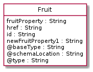
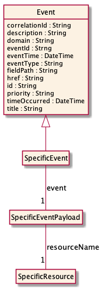

# NOTICE

Copyright © TM Forum 2022. All Rights Reserved.

This document and translations of it may be copied and furnished to
others, and derivative works that comment on or otherwise explain it or
assist in its implementation may be prepared, copied, published, and
distributed, in whole or in part, without restriction of any kind,
provided that the above copyright notice and this section are included
on all such copies and derivative works. However, this document itself
may not be modified in any way, including by removing the copyright
notice or references to TM FORUM, except as needed for the purpose of
developing any document or deliverable produced by a TM FORUM
Collaboration Project Team (in which case the rules applicable to
copyrights, as set forth in the [TM FORUM IPR
Policy](http://www.tmforum.org/IPRPolicy/11525/home.html), must be
followed) or as required to translate it into languages other than
English.

The limited permissions granted above are perpetual and will not be
revoked by TM FORUM or its successors or assigns.

This document and the information contained herein is provided on an "AS
IS" basis and TM FORUM DISCLAIMS ALL WARRANTIES, EXPRESS OR IMPLIED,
INCLUDING BUT NOT LIMITED TO ANY WARRANTY THAT THE USE OF THE
INFORMATION HEREIN WILL NOT INFRINGE ANY OWNERSHIP RIGHTS OR ANY IMPLIED
WARRANTIES OF MERCHANTABILITY OR FITNESS FOR A PARTICULAR PURPOSE.

Direct inquiries to the TM Forum office:

4 Century Drive, Suite 100  
Parsippany, NJ 07054, USA  
Tel No. +1 973 944 5100  
Fax No. +1 973 988 7196

TM Forum Web Page: [www.tmforum.org](http://www.tmforum.org/)

# Introduction

The following document is the user guide of the REST API for Any
management. It includes the model definition as well as all available
operations.

# Sample Use Cases

Reader will find example of use cases using Usage API in “Open Digital
Business Scenarios and Use Cases” document.

# Support of polymorphism and extension patterns

Support of polymorphic collections and types and schema based extension
is provided by means of a list of generic meta-attributes that we
describe below. Polymorphism in collections occurs when entities inherit
from base entities, for instance a BillingAccount and SettlementAccount
inheriting properties from the abstract Account entity.

Generic support of polymorphism and pattern extensions is described in
the TMF API Guidelines v3.0 Part 2 document.

The @type attribute provides a way to represent the actual class type of
an entity. For example, within a list of Account instances some may be
instances of BillingAccount where other could be instances of
SettlementAccount. The @type gives this information. All resources and
sub-resources of this API have a @type attributes that can be provided
when this is useful.

The @referredType can be used within reference entities (like for
instance an AccountRef object) to explicitly denote the actual entity
type of the referred class. Notice that in reference entities the @type,
when used, denotes the class type of the reference itself, such as
BillingAccountRef or SettlementAccountRef, and not the class type of the
referred object. However since reference classes are rarely sub-classed,
@type is generally not useful in reference objects.

The @schemaLocation property can be used in resources to allow
specifying user-defined properties of an Entity or to specify the
expected characteristics of an entity.

The @baseType attribute gives a way to provide explicitly the base of
class of a given resource that has been extended.

# RESOURCE MODEL

## Managed Entity and Task Resource Models

### Fruit resource

A JSON Schema I.

**Resource model**

**Field descriptions**

**Fruit fields**

<table>
<colgroup>
<col style="width: 35%" />
<col style="width: 65%" />
</colgroup>
<tbody>
<tr class="odd">
<td style="text-align: left;">
fruitProperty
</td>
<td style="text-align: left;">
A String. FruitProperty
description.
</td>
</tr>
<tr class="even">
<td style="text-align: left;">
href
</td>
<td style="text-align: left;">
A String. Hyperlink reference.
</td>
</tr>
<tr class="odd">
<td style="text-align: left;">
id
</td>
<td style="text-align: left;">
A String. Unique identifier.
</td>
</tr>
<tr class="even">
<td style="text-align: left;">
newFruitProperty1
</td>
<td style="text-align: left;">
A String. New FruitProperty
description.
</td>
</tr>
</tbody>
</table>

## Notification Resource Models

0 notifications are defined for this API.

Notifications related to Fruit:

The notification structure for all notifications in this API follow the
pattern depicted by the figure below. A notification event resource
(depicted by "SpecificEvent" placeholder) is a sub class of a generic
Event structure containing at least an id of the event occurrence
(eventId), an event timestamp (eventTime), and the name of the resource
(eventType). This notification structure owns an event payload structure
("SpecificEventPayload" placeholder) linked to the resource concerned by
the notification using the resource name as access field ("resourceName"
placeholder).

Figure 1 - Notification Pattern

# API OPERATIONS

Remember the following Uniform Contract:

<table>
<colgroup>
<col style="width: 33%" />
<col style="width: 33%" />
<col style="width: 33%" />
</colgroup>
<thead>
<tr class="header">
<th style="text-align: left;">Operation on Entities</th>
<th style="text-align: left;">Uniform API Operation</th>
<th style="text-align: left;">Description</th>
</tr>
</thead>
<tbody>
<tr class="odd">
<td style="text-align: left;">
Query Entities
</td>
<td style="text-align: left;">
GET Resource
</td>
<td style="text-align: left;">
GET must be used to retrieve a
representation of a resource.
</td>
</tr>
<tr class="even">
<td style="text-align: left;">
Create Entity
</td>
<td style="text-align: left;">
POST Resource
</td>
<td style="text-align: left;">
POST must be used to create a new
resource
</td>
</tr>
<tr class="odd">
<td style="text-align: left;">
Partial Update of an Entity
</td>
<td style="text-align: left;">
PATCH Resource
</td>
<td style="text-align: left;">
PATCH must be used to partially update
a resource
</td>
</tr>
<tr class="even">
<td style="text-align: left;">
Remove an Entity
</td>
<td style="text-align: left;">
DELETE Resource
</td>
<td style="text-align: left;">
DELETE must be used to remove a
resource
</td>
</tr>
<tr class="odd">
<td style="text-align: left;">
Execute an Action on an Entity
</td>
<td style="text-align: left;">
POST on TASK Resource
</td>
<td style="text-align: left;">
POST must be used to execute Task
Resources
</td>
</tr>
<tr class="even">
<td style="text-align: left;">
Other Request Methods
</td>
<td style="text-align: left;">
POST on TASK Resource
</td>
<td style="text-align: left;">
GET and POST must not be used to tunnel
other request methods.
</td>
</tr>
</tbody>
</table>

Filtering and attribute selection rules are described in the TMF REST
Design Guidelines.

Notifications are also described in a subsequent section.

## Operations on Fruit

### Retrieves a Fruit by ID

`GET /fruit/{id}?fields=…​&{filtering}`

**Description**

This operation retrieves a Fruit entity. Attribute selection is enabled
for all first level attributes. Filtering may be available depending on
the compliance level supported by an implementation.

### List or find Fruit objects

`GET /fruit`

**Description**

This operation list Fruit entities. Attribute selection is enabled for
all first level attributes. Filtering may be available depending on the
compliance level supported by an implementation.

# API NOTIFICATIONS

For every single of operation on the entities use the following
templates and provide sample REST notification POST calls.

It is assumed that the Pub/Sub uses the Register and UnRegister
mechanisms described in the REST Guidelines reproduced below.

## Register listener

**POST /hub**

**Description**

Sets the communication endpoint address the service instance must use to
deliver information about its health state, execution state, failures
and metrics. Subsequent POST calls will be rejected by the service if it
does not support multiple listeners. In this case DELETE /api/hub/{id}
must be called before an endpoint can be created again.

**Behavior**

Returns HTTP/1.1 status code 204 if the request was successful.

Returns HTTP/1.1 status code 409 if request is not successful.

**Usage Samples**

Here’s an example of a request for registering a listener.

**Request**

    POST /api/hub

    Accept: application/json

    {
        "callback": "http://in.listener.com"
    }

**Response**

    201

    Content-Type: application/json

    Location: /api/hub/42

    {
        "id":"42",
        "callback": "http://in.listener.com",
        "query":""
    }

## Unregister listener

**DELETE /hub/{id}**

**Description**

Clears the communication endpoint address that was set by creating the
Hub..

**Behavior**

Returns HTTP/1.1 status code 204 if the request was successful.

Returns HTTP/1.1 status code 404 if the resource is not found.

**Usage Samples**

Here’s an example of a request for un-registering a listener.

**Request**

    DELETE /api/hub/42

    Accept: application/json

**Response**

    204

## Publish Event to listener

**POST /client/listener**

**Description**

Clears the communication endpoint address that was set by creating the
Hub.

Provides to a registered listener the description of the event that was
raised. The /client/listener url is the callback url passed when
registering the listener.

**Behavior**

Returns HTTP/1.1 status code 201 if the service is able to set the
configuration.

**Usage Samples**

Here’s an example of a notification received by the listener. In this
example “EVENT TYPE” should be replaced by one of the notification types
supported by this API (see Notification resources Models section) and
EVENT BODY refers to the data structure of the given notification type.

**Request**

    POST /client/listener

    Accept: application/json

    {
        "event": {
            EVENT BODY
        },
        "eventType": "EVENT_TYPE"
    }

**Response**

    201

For detailed examples on the general TM Forum notification mechanism,
see the TMF REST Design Guidelines.

# Acknowledgements

## Release History

<table>
<colgroup>
<col style="width: 15%" />
<col style="width: 15%" />
<col style="width: 30%" />
<col style="width: 40%" />
</colgroup>
<tbody>
<tr class="odd">
<td style="text-align: left;">
<strong>Release
Number</strong>
</td>
<td style="text-align: left;">
<strong>Date</strong>
</td>
<td style="text-align: left;">
<strong>Release led
by:</strong>
</td>
<td style="text-align: left;">
<strong>Description</strong>
</td>
</tr>
<tr class="even">
<td style="text-align: left;"></td>
<td style="text-align: left;"></td>
<td style="text-align: left;"></td>
<td style="text-align: left;"></td>
</tr>
<tr class="odd">
<td style="text-align: left;"></td>
<td style="text-align: left;"></td>
<td style="text-align: left;"></td>
<td style="text-align: left;"></td>
</tr>
</tbody>
</table>

## Contributors to Document

<table>
<colgroup>
<col style="width: 50%" />
<col style="width: 50%" />
</colgroup>
<tbody>
<tr class="odd">
<td style="text-align: left;"></td>
<td style="text-align: left;"></td>
</tr>
<tr class="even">
<td style="text-align: left;"></td>
<td style="text-align: left;"></td>
</tr>
</tbody>
</table>
